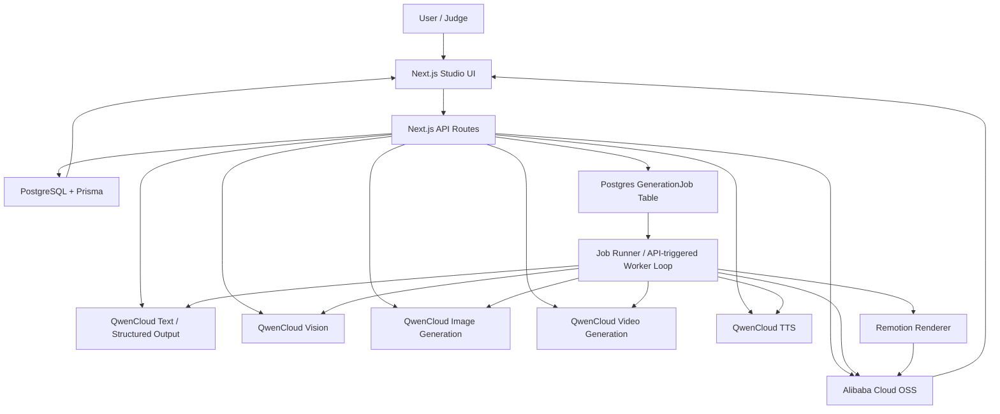

# Reel AI Architecture

Updated: July 13, 2026

This document describes the target MVP architecture. The implementation source of truth is `docs/implementation-guide.md`.

## System Diagram

## Runtime Components

- `apps/web`: Next.js App Router application containing the studio UI and route handlers.
- `apps/web/lib/qwen`: server-only QwenCloud clients.
- `apps/web/lib/agents`: orchestration for Brand Kit, concepts, storyboard, policy review, and production steps.
- `apps/web/lib/jobs`: Postgres-backed job creation, claiming, polling, and status updates.
- `apps/web/lib/oss`: Alibaba Cloud OSS upload/download helpers.
- `apps/web/remotion`: MP4 composition and export.
- `prisma`: schema, migrations, seed data.

## Main Data Flow

1. User supplies a company website and, optionally, a short creative direction. Advanced project fields remain available but are not required for the primary flow. The direction is stored with the website source metadata, avoiding a project-schema migration for transient generation guidance.
2. The API persists the project and website source, infers placeholder identity from the hostname when needed, creates a queued `BRAND_KIT` job, and returns immediately. Next.js `after()` starts the job after the response so navigation is not held open by model latency.
3. Brand research follows a small set of same-origin product/about links and collects metadata, visible copy, CSS/HTML color candidates, and likely logo/social-image URLs. Uploaded assets are stored in OSS as `Artifact` rows.
4. QwenCloud vision analyzes accessible website and uploaded visuals; structured generation combines that evidence with text sources and saves the reusable `BrandKit`. Hostname-inferred project identity is replaced by a researched site name only when the user did not explicitly name the project.
5. Concept generation derives explicit capabilities from uploaded sources. Without an uploaded logo, product image, UI screenshot/reference ad, or other visual source, prompts prohibit manufacturing those visual elements. Structured concepts are validated before image spend. A single concept can also be regenerated with an optional concise adjustment note; that prompt includes the Brand Kit, verified evidence, the target being replaced, and the two retained concepts as anti-duplication context.
6. Preview prompts receive the same grounding constraints. Each generated preview is reviewed by QwenCloud vision; rejected or unavailable previews fall back to a clearly designed local concept card instead of presenting fabricated imagery as grounded output. Single-concept replacement is atomic from the user's perspective: the retained concepts keep their IDs and previews, the replacement keeps its concept ID and selection state, and only its superseded preview is cleaned up after persistence. If it drives a storyboard, that storyboard and its scenes return to draft review while prior production artifacts remain durable.
7. User selects a concept. Legacy previews without grounding metadata cannot advance until regenerated.
8. Storyboard generation begins with a capability preflight against the selected concept. Missing visual references are treated as adaptation constraints, not upload blockers: the first prompt preserves strategy while replacing unsupported logos, products, or interfaces with unbranded human/environmental storytelling. Deterministic validation is negation-aware, so instructions such as “no logo” are not mistaken for asset requests. If a candidate still violates grounding, one bounded model recovery pass rewrites it; a deterministic safe-text fallback removes any residual unsupported visual or claim language before final validation. Only a candidate that still fails after all recovery layers stops for human review. The successful recovery method and omitted capabilities are persisted in the storyboard job output and explained in the editor. The resulting storyboard creates separate product/character/visual-world continuity locks, classifies every transition as continuous, match-cut, or intentional change, and renders as a first/last-frame filmstrip.
9. Keyframe jobs generate and store an explicit recommended opening/closing pair for every scene in OSS. When provider-accessible uploaded product/logo/reference imagery exists it is supplied as visual grounding. Within a scene the generated opening guides the closing frame; across continuous and match-cut scenes, the prior closing frame guides the next opening frame. Intentional-change transitions deliberately break that frame chain while retaining the shared continuity bible in the prompt. The Production UI presents these pairs as one stitched story flow; prior attempts remain available as low-emphasis history instead of requiring another round of horizontal choices.
10. Video jobs submit each approved opening/closing pair through the Wan 2.7 unified i2v protocol and poll QwenCloud until clips are complete. The newest successful clip becomes the recommended selection automatically. Legacy model overrides retain the older first-frame request shape.
11. TTS job generates narration audio.
12. Render job uses Remotion to produce the final 9:16 MP4 and thumbnail.
13. Final artifacts are stored in OSS and displayed in the studio.

## Evidence capability model

ReelAI distinguishes knowing that a product or service exists from having permission-quality visual evidence to reproduce it:

- Website copy can support cautious positioning and claims, but does not authorize invention of a product interface or exact product appearance.
- A `LOGO` upload authorizes logo-aware direction; absent that source, image generation cannot draw logos, wordmarks, branded uniforms, or badges.
- A `PRODUCT_IMAGE` upload authorizes referenced product depiction; absent it, visuals remain generic and unbranded.
- A `REFERENCE_AD` or clearly labeled UI/screenshot upload authorizes interface-aware direction; absent it, concepts cannot use phones, dashboards, profiles, buttons, or booking flows.
- Plain-language trust descriptors such as vetted, verified, and certified are permitted in concept copy, but cannot be visualized as official seals, badges, accreditations, or government endorsement. Higher-assurance claims—licensed/licenced, accredited, bonded, insured, government-approved, background-checked, police-checked, medical credentials, and named compliance certifications—must appear in supported Brand Kit claims. Specific availability, pricing, guarantees, testimonials, and quantified outcomes also require source support.

These restrictions are enforced in prompts, deterministic validation, preview metadata, selection APIs, and storyboard validation rather than relying on model instructions alone.

## Editability and modular regeneration audit

- Concepts support both full-set regeneration and note-guided single replacement. Only one concept-generation job may mutate a project at a time.
- Storyboards are fully editable field by field after generation, including their global continuity bible and per-scene transition modes, but AI regeneration currently replaces the whole 2-to-4-scene plan. Per-scene note-guided regeneration is the next high-value modular addition; it must include adjacent-scene continuity and invalidate only downstream takes for that scene.
- Production is additive and modular without making history the primary workflow: keyframe and video attempts create takes rather than destructively replacing prior artifacts, while the newest complete opening/closing pair and clip become the recommended path automatically. Saving a changed image/continuity brief clears stale endpoint and video selections; motion-only changes clear only the stale video selection. Historical takes remain visible in a collapsed archive.
- Brand Kits can be regenerated but not field-edited. A future editor should distinguish source-backed claims/citations from user-owned tone, palette, and style overrides instead of exposing an unsafe generic JSON edit.
- Narration and final render are appropriately project-level operations today because their timing and composition depend on the complete approved storyboard.

## Project and Brand Kit boundary

Project setup and initial Brand Kit generation are one user action, but remain separate domain operations. The project is the durable workspace; Brand Kit generation is a retryable, versionable job. This preserves fast navigation, failure isolation, regeneration, source uploads, and future queue/worker migration. A failed research run never rolls back or loses the project.

Trade-offs:

- Automatic generation spends model tokens on every URL-first project. The API retains `generateBrandKit: false` for programmatic or advanced creation paths.
- Hostname-derived names are temporary context, not asserted brand facts; researched content supplies the actual Brand Kit evidence.
- Lightweight crawling is intentionally bounded to the homepage and up to three relevant same-origin pages. JavaScript-only or bot-protected sites may still need uploaded brand assets.
- `after()` is suitable for the current MVP deployment. Production scale should move job execution to a durable worker/queue so work survives process restarts and supports retries/backoff.

## Landing workspace and deletion

The home experience intentionally shows only workspace navigation and project creation. Runtime implementation details and inspector metrics are omitted because they do not help users start or resume work; pipeline guidance is available in a collapsed disclosure.

Project deletion is an explicit, confirmed action available from the home project list. The API refuses deletion while a generation job is active, attempts to remove associated local or OSS objects, and then relies on PostgreSQL cascade relations to remove the project graph. Storage cleanup failures are logged without leaving an undeletable database project.

## Deployment Topology

MVP deployment uses Alibaba Cloud ECS + Docker Compose:

- `web` container: Next.js app, API routes, lightweight worker loop, and Remotion renderer.
- PostgreSQL: RDS preferred; Docker Compose Postgres allowed for hackathon-only proof.
- OSS: persistent storage for uploads, generated images, clips, audio, thumbnails, and final render.

Function Compute is a later deployment option. ECS is the MVP default because video polling and media rendering are easier to debug.

## Security Boundaries

- QwenCloud and OSS credentials are server-side only.
- `.env` is ignored and must not be committed.
- Client components receive artifact IDs/URLs and job statuses, never API keys.
- Logs must include model/task/status metadata but must not include secrets.
- Provider URLs that expire are copied into OSS before being treated as durable artifacts.
- Website crawling is bounded by page count, response timeout, content type, and response size. Production hardening should also add DNS/IP allow-list checks to prevent SSRF and a robots/terms policy appropriate to the deployment.

## MVP Scalability Limits

- Jobs are stored in Postgres, not Redis.
- Polling is app-driven and suitable for hackathon/demo scale.
- Long-running high-volume rendering is not supported in MVP.
- Generated 60-second reels are stretch; the reliable target is 15 to 30 seconds.
