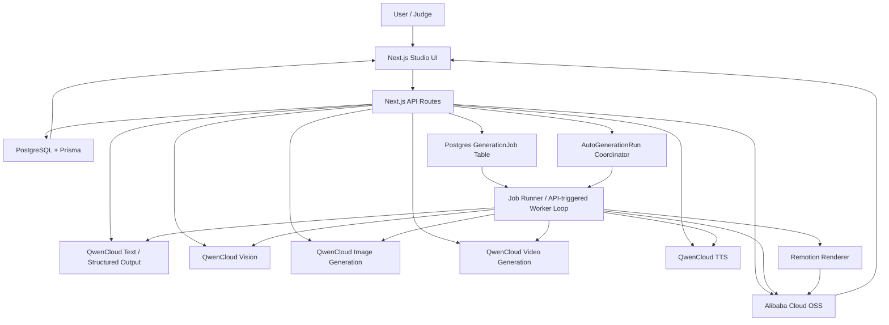

# Reel AI Architecture

Updated: July 15, 2026

This document describes the target MVP architecture. The implementation source of truth is `docs/implementation-guide.md`.

## System Diagram

## Runtime Components

- `apps/web`: Next.js App Router application containing the studio UI and route handlers.
- `apps/web/lib/qwen`: server-only QwenCloud clients.
- `apps/web/lib/agents`: orchestration for Brand Kit, concepts, storyboard, policy review, and production steps.
- `apps/web/lib/jobs`: Postgres-backed job creation, claiming, polling, and status updates.
- `apps/web/lib/oss`: Alibaba Cloud OSS upload/download helpers.
- `apps/web/remotion`: MP4 composition and export.
- `prisma`: schema, migrations, seed data.

## Main Data Flow

1. User supplies a company website and, optionally, a short creative direction. Advanced project fields remain available but are not required for the primary flow. The direction is stored with the website source metadata, avoiding a project-schema migration for transient generation guidance.
   Product Showcase is an alternate intake lane: the user supplies one to three named products, at least one image for each product, no more than three product images total, optional product details/product-page URLs, a 5/10/15-second target, and realistic or 3D style. The project is created without starting research, images are durably uploaded and linked to their `ProjectProduct`, then Brand Kit generation is queued. A failed intake upload removes the incomplete project.
2. The API persists the project and website source, infers placeholder identity from the hostname when needed, creates a queued `BRAND_KIT` job, and returns immediately. Next.js `after()` starts the job after the response so navigation is not held open by model latency.
3. Brand research follows a small set of same-origin product/about links and collects metadata, visible copy, CSS/HTML color candidates, and likely logo/social-image URLs. Uploaded assets are stored in OSS as `Artifact` rows.
4. QwenCloud vision analyzes accessible website and uploaded visuals; structured generation combines that evidence with text sources and saves the reusable `BrandKit`. Hostname-inferred project identity is replaced by a researched site name only when the user did not explicitly name the project.
5. Concept generation derives explicit capabilities from uploaded sources. Without an uploaded logo, product image, UI screenshot/reference ad, or other visual source, prompts prohibit manufacturing those visual elements. Structured concepts are validated before image spend. A single concept can also be regenerated with an optional concise adjustment note; that prompt includes the Brand Kit, verified evidence, the target being replaced, and the two retained concepts as anti-duplication context.
6. Preview prompts receive the same grounding constraints. Each generated preview is reviewed by QwenCloud vision; rejected or unavailable previews fall back to a clearly designed local concept card instead of presenting fabricated imagery as grounded output. Single-concept replacement is atomic from the user's perspective: the retained concepts keep their IDs and previews, the replacement keeps its concept ID and selection state, and only its superseded preview is cleaned up after persistence. If it drives a storyboard, that storyboard and its scenes return to draft review while prior production artifacts remain durable.
7. User selects a concept. The concept screen also persists **Cinematic Boost**, which deliberately increases visual scale, lighting contrast, reveal timing, depth, and physically credible motion in concepts and downstream storyboards without weakening evidence constraints. Legacy previews without grounding metadata cannot advance until regenerated. Before the first production spend, a Brand Kit handoff summarizes website evidence and uploaded brand assets, explains their role in generation, and offers an add-material path. Auto mode is selected by default; step-by-step mode preserves the original manual approvals.
8. Storyboard generation begins with a capability preflight against the selected concept. Missing visual references are treated as adaptation constraints, not upload blockers: the first prompt preserves strategy while replacing unsupported logos, products, or interfaces with unbranded human/environmental storytelling. Deterministic validation is negation-aware, so instructions such as “no logo” are not mistaken for asset requests. If a candidate still violates grounding, one bounded model recovery pass rewrites it; a deterministic safe-text fallback removes any residual unsupported visual or claim language before final validation. Only a candidate that still fails after all recovery layers stops for human review. The successful recovery method and omitted capabilities are persisted in the storyboard job output and explained in the editor. The resulting storyboard creates separate product/character/visual-world continuity locks, classifies continuity as continuous, match-cut, or intentional change, and separately chooses a reviewable transition style (`CUT`, `FADE`, `SLIDE`, `WIPE`, `IRIS`, or `CLOCK_WIPE`) for each incoming scene.
9. Storyboard generation first selects an offer-appropriate execution lane—people/service, product/retail/food, software/digital, place/hospitality/property, expertise/B2B/education, or creator/event/abstract brand—so visual interest comes from the subject rather than a universal service-ad template. It produces one `shotPrompt` per scene under a generation-safety contract: exactly one mood-first sentence of 14–60 words, at most one motivated two-beat progression, exactly one supported camera behavior, no passive framing language, and a 5–10 second duration. Visible story change, layered composition, tactile motion, and cross-scene camera variety remain explicit creative guidance, but are not enforced through a finite vocabulary that can reject valid model prose.

   The continuity bible also carries a structured cast plan with explicit no-person, single-person, and multi-person modes. Each human role has a recurrence flag, age band, reference basis, three to five appearance anchors, optional neutral complexion/fictional heritage anchor, wardrobe anchor, and distinguishing feature. Multi-person signatures must be unique. Ethnicity is never inferred for a reference-backed person or used as a proxy for behavior or status. Keyframe prompts serialize this ledger into the existing character-continuity field, enforce face/silhouette separation, and can reference the two most recent anchors so a recurring person can return after a scene gap without being replaced by the prior scene's supporting character. No database migration is required.
   Provider JSON that contains substantive scene intent but narrowly misses the prose contract is canonicalized before final validation: Reel AI preserves the first clear action, promotes a short opening fragment to the mood anchor, preserves a supported camera move even when it was emitted as a separate sentence, and defaults an omitted camera brief to a fixed camera. Product Showcase durations and narration budgets are reconciled to the exact project target; an over-segmented five-second result is reduced to one hero visual carrying the closer's CTA copy. Caption/narration pairs and safe continuity metadata recover locally, and an unambiguously product-only scene can receive a no-people cast plan. A missing top-level script is reconstructed from validated scene narration, and disabled audio metadata receives explicit non-empty sentinel values; Product Showcase forces this narration-only state regardless of provider output. If model repair is needed, the original project prompt remains in the repair context, and both the initial request and repair can fall back from strict schema mode to JSON-object mode when the provider rejects strict response formatting. Missing or generic shot directions, product facts, and ambiguous cast identities still fail rather than being silently fabricated.

10. Video jobs preflight each selected anchor and submit exactly the stored `shotPrompt` as the positive Wan i2v prompt. The provider receives no closing frame and no appended brand, transition, exit, caption, or continuity paragraphs. Prompt rewriting is disabled to preserve the approved sentence, while a dedicated negative prompt suppresses morphing, duplicate anatomy, flicker, jitter, abrupt camera changes, generated text, and watermarks. Healthy sibling tasks continue polling when one scene fails, transient submission failures receive bounded retries, and scene-level retries preserve completed siblings and prior selected clips.

    Product Showcase uses the same manual and Auto mode jobs. Its timing contract is a feasible 1–3 scenes totaling the project's exact 5, 10, or 15 second target. The shared timing validator runs at structured parsing, manual approval, Auto reconciliation, production, and final export. Product uploads are ordered ahead of logos and general references for preview/keyframe grounding. Each Product Showcase concept persists `showcaseMotionPlan` JSON (hero action, optional supporting motion, camera behavior, human presence, separation treatment, and rationale), which the concept UI exposes and the storyboard prompt inherits. Prompts lock silhouette, proportions, materials, colors, packaging, surface details, and visible ingredients; category-native motion is selected from real product/material behavior, with one hero action and at most one simple grounded supporting material behavior. The deterministic motion boundary permits no people or one person total, rejects overloaded screens, and treats separation as category-dependent: visible verified food layers or explicit large modular exterior pieces may move judiciously, while electronics, fabrics, screens, and unknown products cannot use teardown. It runs after concepts, after storyboard generation with one repair opportunity, on manual saves, and before production. Multiple products appear sequentially or as a static collection, never as simultaneous transformations. Wan source requests stay silent and Remotion mutes them again; Product Showcase also rejects BGM at the render boundary so scene narration is its only final audio layer.

This separation follows QwenCloud's [first-frame image-to-video guidance](https://docs.qwencloud.com/developer-guides/video-generation/image-to-video): the image establishes the subject, environment, and composition while the prompt describes the desired motion. Wan 2.7's [API contract](https://docs.qwencloud.com/api-reference/video-generation/wan27-image-to-video/create-task) provides dedicated `negative_prompt` and `prompt_extend` controls, so Reel AI keeps artifact suppression and prompt rewriting out of the approved creative sentence.

11. One TTS job generates a durable narration artifact for each non-silent scene. It measures the WAV bytes, records a scene-local start offset and playback rate, caps timing correction at 1.20×, and rejects a line that cannot fit naturally. Editing voiceover text or scene duration invalidates the manifest and its scene links.
12. Render job uses Remotion to sequence each narration artifact inside its owning scene and add short audio fades. Standard reels resolve the storyboard's AI-selected curated BGM id (or a manual Final-step override), hash-version the public WAV into the project artifact store, loop it, fade its reel edges, and duck it during speech. Legacy project-wide narration and null-track storyboards remain supported; the latter are mood-matched from their saved direction. Product Showcase suppresses this layer at the render boundary. The official Remotion transition presentations are selected from persisted scene intent; sequence timing absorbs each short overlap so the exported duration still equals the storyboard total. Only the last scene receives a closer/CTA caption: the verified logo owns the full closing shot, while the closure copy enters at its midpoint so the first half remains unobstructed video. Video and audio artifacts are streamed through the app's authenticated, same-origin endpoint with HTTP byte-range and CORS support; Remotion Media can therefore seek into OSS-backed clips instead of requiring a full-file download for each rendered frame. Rendering uses bounded media retries, a 120-second timeout, and conservative concurrency. Remotion then produces the final 9:16 MP4 and thumbnail. The latest uploaded `LOGO` image—or a directly discovered website asset explicitly labeled as a logo/wordmark—is rendered with Remotion's image component, which blocks frame capture until the complete asset downloads and decodes and retries transient loads. This prevents progressive or partially decoded image scanlines from entering the export. The logo is composited alone at three times the previous mark size; the business name is used only when no verified logo is available. Generative image/video prompts continue to prohibit synthetic logo drawing.
13. Final artifacts are stored in OSS and displayed in the studio. The media library reads render records with a persisted artifact and resolves each one to its exact `FINAL_RENDER` artifact and render-specific thumbnail. This preserves historical finished MP4s after a storyboard edit marks their render record stale, labeling them as previous versions. It excludes any render without a finished final artifact plus all non-final artifacts at the server query/mapping boundary, then groups the eligible outputs by project for playback and download. This is a read-only view over the render graph: it creates no alternate generation path and does not change Auto or step-by-step production coordination.

### Auto mode coordination

Auto mode persists a separate `AutoGenerationRun` over the existing provider-facing `GenerationJob` records. Its phase order is Storyboard, Scene Anchors, Video Clips, Narration, and Remotion Render. Client polling claims a time-bounded database lease and advances one phase; each phase verifies its durable prerequisites and outputs before creating work. While the run is active, the project workflow is replaced by a focused progress surface and manual mutation APIs return HTTP 409; this protects against both visible controls and stale tabs. Storyboard and production job creation retain their project-level concurrency locks. This makes page reloads and server restarts resumable without regenerating successful media. Transient provider and polling failures use bounded exponential backoff, provider video tasks retain their task IDs, and partial clip retries target only missing scenes. If deterministic normalization plus the structured layer's repair pass still cannot validate a creative result, Auto mode performs one fresh reroll and then stops (two full creative attempts maximum). This absorbs occasional provider variance without an unbounded paid loop. A second miss preserves completed work, stores safe field-level diagnostics in the failed job, explains the pause without schema internals, and offers an explicit phase-scoped retry. Non-transient or exhausted failures restore the relevant manual editor with the completed graph intact.

## Evidence capability model

ReelAI distinguishes knowing that a product or service exists from having permission-quality visual evidence to reproduce it:

- Website copy can support cautious positioning and claims, but does not authorize invention of a product interface or exact product appearance.
- A `LOGO` upload authorizes logo-aware direction and supplies the preferred exact asset for the final last-scene Remotion lockup; a directly discovered website logo/wordmark may be composited without asking a model to recreate it. Without an uploaded logo, image generation still cannot draw logos, branded uniforms, or badges, and the renderer falls back to the business name when no verified website asset is reachable.
- A `PRODUCT_IMAGE` upload authorizes referenced product depiction; absent it, visuals remain generic and unbranded.
- A `REFERENCE_AD` or clearly labeled UI/screenshot upload authorizes interface-aware direction; absent it, concepts cannot use phones, dashboards, profiles, buttons, or booking flows.
- Plain-language trust descriptors such as vetted, verified, and certified are permitted in concept copy, but cannot be visualized as official seals, badges, accreditations, or government endorsement. Higher-assurance claims—licensed/licenced, accredited, bonded, insured, government-approved, background-checked, police-checked, medical credentials, and named compliance certifications—must appear in supported Brand Kit claims. Specific availability, pricing, guarantees, testimonials, and quantified outcomes also require source support.

These restrictions are enforced in prompts, deterministic validation, preview metadata, selection APIs, and storyboard validation rather than relying on model instructions alone.

## Editability and modular regeneration audit

- Concepts support both full-set regeneration and note-guided single replacement. Only one concept-generation job may mutate a project at a time.
- Storyboards are fully editable field by field after generation, including their global continuity bible and per-scene transition modes, but AI regeneration currently replaces the whole 2-to-4-scene plan. Per-scene note-guided regeneration is the next high-value modular addition; it must include adjacent-scene continuity and invalidate only downstream takes for that scene.
- Production is additive and modular without making history the primary workflow: anchor and video attempts create takes rather than destructively replacing prior artifacts, while the newest complete anchor and clip become the recommended path automatically. Changing the one shot sentence or continuity metadata invalidates that scene and downstream anchors/clips; timing-only changes invalidate only that clip. Historical takes remain visible in a collapsed archive. Final render validates the entire ordered storyboard, uses direct cuts without per-scene fade-from-black, and never exports a filtered subset of completed scenes.
- Brand Kits can be regenerated but not field-edited. A future editor should distinguish source-backed claims/citations from user-owned tone, palette, and style overrides instead of exposing an unsafe generic JSON edit.
- Narration generation remains one project-level job for consistent voice and atomic replacement, but its outputs and render windows are scene-level. Final render consumes the complete approved storyboard and the current scene narration manifest.

## Project and Brand Kit boundary

Project setup and initial Brand Kit generation are one user action, but remain separate domain operations. The project is the durable workspace; Brand Kit generation is a retryable, versionable job. This preserves fast navigation, failure isolation, regeneration, source uploads, and future queue/worker migration. A failed research run never rolls back or loses the project.

Trade-offs:

- Automatic generation spends model tokens on every URL-first project. The API retains `generateBrandKit: false` for programmatic or advanced creation paths.
- Hostname-derived names are temporary context, not asserted brand facts; researched content supplies the actual Brand Kit evidence.
- Lightweight crawling is intentionally bounded to the homepage and up to three relevant same-origin pages. JavaScript-only or bot-protected sites may still need uploaded brand assets.
- `after()` is suitable for the current MVP deployment. Production scale should move job execution to a durable worker/queue so work survives process restarts and supports retries/backoff.

## Landing workspace and deletion

The home experience intentionally shows only workspace navigation and project creation. Runtime implementation details and inspector metrics are omitted because they do not help users start or resume work; pipeline guidance is available in a collapsed disclosure.

Project deletion is an explicit, confirmed action available from the home project list. The API refuses deletion while a generation job is active, attempts to remove associated local or OSS objects, and then relies on PostgreSQL cascade relations to remove the project graph. Storage cleanup failures are logged without leaving an undeletable database project.

## Deployment Topology

MVP deployment uses Alibaba Cloud ECS + Docker Compose:

- `web` container: Next.js app, API routes, lightweight worker loop, and Remotion renderer.
- PostgreSQL: RDS preferred; Docker Compose Postgres allowed for hackathon-only proof.
- OSS: persistent storage for uploads, generated images, clips, audio, thumbnails, and final render.

Function Compute is a later deployment option. ECS is the MVP default because video polling and media rendering are easier to debug.

## Security Boundaries

- QwenCloud and OSS credentials are server-side only.
- `.env` is ignored and must not be committed.
- Client components receive artifact IDs/URLs and job statuses, never API keys.
- Logs must include model/task/status metadata but must not include secrets.
- Provider URLs that expire are copied into OSS before being treated as durable artifacts.
- Website crawling is bounded by page count, response timeout, content type, and response size. Production hardening should also add DNS/IP allow-list checks to prevent SSRF and a robots/terms policy appropriate to the deployment.

## MVP Scalability Limits

- Jobs are stored in Postgres, not Redis.
- Polling is app-driven and suitable for hackathon/demo scale.
- Long-running high-volume rendering is not supported in MVP.
- Generated 60-second reels are stretch; the reliable target is 15 to 30 seconds.
