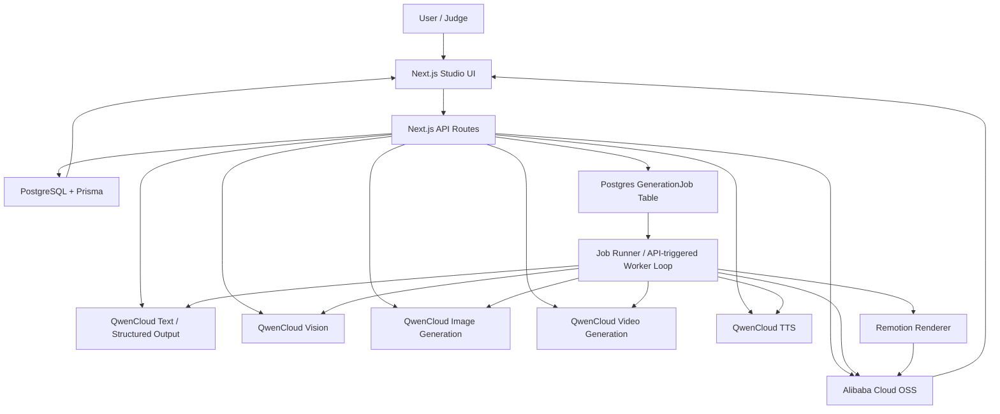

# Reel AI Architecture

Updated: July 5, 2026

This document describes the target MVP architecture. The implementation source of truth is `docs/implementation-guide.md`.

## System Diagram

## Runtime Components

- `apps/web`: Next.js App Router application containing the studio UI and route handlers.
- `apps/web/lib/qwen`: server-only QwenCloud clients.
- `apps/web/lib/agents`: orchestration for Brand Kit, concepts, storyboard, policy review, and production steps.
- `apps/web/lib/jobs`: Postgres-backed job creation, claiming, polling, and status updates.
- `apps/web/lib/oss`: Alibaba Cloud OSS upload/download helpers.
- `apps/web/remotion`: MP4 composition and export.
- `prisma`: schema, migrations, seed data.

## Main Data Flow

1. User creates a project with website URL, business information, and optional uploads.
2. Sources are extracted and stored as `BrandSource` rows; uploads are stored in OSS as `Artifact` rows.
3. Brand Kit job calls QwenCloud text/vision and saves a `BrandKit`.
4. Concept job calls QwenCloud text for three concepts and image generation for preview frames.
5. User selects a concept.
6. Storyboard job creates editable scenes with prompts, captions, narration text, and continuity notes.
7. Keyframe job generates start/end scene images and stores them in OSS.
8. Video job submits i2v tasks and polls QwenCloud until clips are complete.
9. TTS job generates narration audio.
10. Render job uses Remotion to produce the final 9:16 MP4 and thumbnail.
11. Final artifacts are stored in OSS and displayed in the studio.

## Deployment Topology

MVP deployment uses Alibaba Cloud ECS + Docker Compose:

- `web` container: Next.js app, API routes, lightweight worker loop, and Remotion renderer.
- PostgreSQL: RDS preferred; Docker Compose Postgres allowed for hackathon-only proof.
- OSS: persistent storage for uploads, generated images, clips, audio, thumbnails, and final render.

Function Compute is a later deployment option. ECS is the MVP default because video polling and media rendering are easier to debug.

## Security Boundaries

- QwenCloud and OSS credentials are server-side only.
- `.env` is ignored and must not be committed.
- Client components receive artifact IDs/URLs and job statuses, never API keys.
- Logs must include model/task/status metadata but must not include secrets.
- Provider URLs that expire are copied into OSS before being treated as durable artifacts.

## MVP Scalability Limits

- Jobs are stored in Postgres, not Redis.
- Polling is app-driven and suitable for hackathon/demo scale.
- Long-running high-volume rendering is not supported in MVP.
- Generated 60-second reels are stretch; the reliable target is 15 to 30 seconds.
