# Reel AI Platform Blueprint

Updated: July 5, 2026

## One-Line Product

Reel AI is an AI showrunner for short-form business ads and story-led social videos: it studies a brand, drafts a one-minute concept, creates an editable storyboard with continuity frames, generates video segments, adds narration and music, and exports a vertical reel.

## Positioning For The Hackathon

Submit under Track 2: AI Showrunner. The project should visibly demonstrate an agentic creative pipeline, not just a form that calls a video API. The strongest demo is: business intake -> brand analysis -> script -> storyboard -> editable scene plan -> generated keyframes -> image-to-video segments -> final stitched reel with voiceover and optional background music.

Judges explicitly ask for a real Alibaba Cloud deployment, QwenCloud API usage in code, an architecture diagram, and a demo video. The proof update also says the repo should include a code file with a visible QwenCloud base URL such as `https://dashscope-intl.aliyuncs.com/compatible-mode/v1`.

Sources:

- https://qwencloud-hackathon.devpost.com/
- https://qwencloud-hackathon.devpost.com/updates/45055-proof-of-deployment-101-what-judges-need-to-see

## Current Repo State

The workspace currently has only `skills-lock.json` plus project-local QwenCloud skills under `.agents/skills`. There is no app scaffold yet, so the build can start cleanly with a modern full-stack TypeScript app.

## Core User Flows

### Flow 1: AI Ad Studio

The user enters:

- Business name
- Website URL
- Target audience
- Product or offer
- Brand materials: logo, product photos, PDFs, pitch deck, screenshots
- Desired format: ad, did-you-know, 5-things, founder story, product explainer, testimonial-style, launch announcement
- Style: realistic or 3D animation
- Length: 15, 30, 45, or 60 seconds
- Voice: narrator profile and tone
- Background music: enabled, disabled, preset mood, or custom prompt

Agent output:

- Brand brief with audience, value proposition, tone, visual motifs, claims to avoid, and source references
- Hook options
- Script
- Scene-by-scene storyboard
- Keyframe prompts for each scene start/end
- Video prompts for each scene
- Voiceover script split into TTS-safe chunks
- Background music prompt
- Final generation plan with cost/time warnings

Human checkpoint:

- Premium storyboard editor where the user can revise copy, timing, visuals, voice, music feel, and generation style before spending video tokens.

### Flow 2: Short Story Generator

The user chooses a theme and story type:

- Did you know
- 5 things to know
- Mini drama
- Myth vs fact
- Before/after transformation
- Founder origin story

This shares the same storyboard and generation engine, but the brand intake is optional.

## What Makes It Original

Most hackathon video demos will stop at text-to-video. Reel AI should emphasize continuity, editorial control, and business usefulness.

Differentiators:

- Continuity-first storyboard: each scene has start and end keyframes, not just a text prompt.
- Brand-aware creative director: website and documents become a concise brand bible.
- Token-budget planner: the agent proposes a low-cost draft path and a high-quality render path.
- Premium storyboard approval UI: generated clips are not launched until the user approves scene prompts.
- Claim safety: the brand analyzer flags unverifiable claims from the script before generation.
- Output-ready reels: final export includes voiceover, optional BGM, captions, and a vertical 9:16 render.
- Judge-friendly pipeline visualization: a live run page shows each agent step, model used, status, and artifacts.

## Recommended Stack

### Frontend

- Next.js App Router with TypeScript
- Tailwind CSS
- shadcn/ui or Radix UI primitives for premium, accessible controls
- Framer Motion for tasteful state transitions
- TanStack Query for job polling and cache state
- Zustand for local storyboard editor state
- React Hook Form + Zod for intake validation
- Remotion or FFmpeg-based rendering for captions, audio mixing, and final composition

UI direction:

- Dark editorial studio, not a generic SaaS landing page.
- First screen should be the usable creator workspace, not a marketing hero.
- Left rail for project history, center for storyboard timeline, right inspector for scene/audio/model settings.
- Use real media previews, progress states, and artifact cards; keep controls compact and production-tool-like.

### Backend

- Next.js route handlers or a small Fastify service in the same repo.
- Prisma with PostgreSQL for projects, scenes, jobs, artifacts, and user settings.
- Redis-compatible queue for background orchestration; on Alibaba Cloud use Tair for Redis if available.
- Object storage with Alibaba Cloud OSS for uploads, generated frames, generated clips, audio, and final exports.
- FFmpeg for stitching clips, mixing voiceover/BGM, and burning captions.
- Playwright for app smoke tests and screenshot proof.

For the hackathon, use a monorepo:

```text
apps/web              Next.js UI and API routes
packages/ai           QwenCloud clients, prompts, schemas
packages/orchestrator Job state machine
packages/media        FFmpeg/Remotion composition helpers
packages/db           Prisma schema
docs                  Blueprint, architecture, deployment notes
```

## QwenCloud Model Plan

Prefer docs-verified models during implementation and confirm with `qwencloud models list --all --format json` before final submission.

### Text And Agent Reasoning

Use `qwen3.7-plus` for scriptwriting, storyboard planning, structured JSON, and brand analysis. The current QwenCloud docs recommend it as a balanced model with 1M context, tool support, function calling, and structured output. Use `qwen3.7-max` only for the final “creative director pass” or complex reasoning.

Source: https://docs.qwencloud.com/developer-guides/getting-started/text-generation-models

### Website And Asset Understanding

Use Qwen vision for screenshots, logos, product photos, PDFs rendered to images, and generated clip review. Use OCR when extracting text from brand materials. Store extracted brand facts with citations back to source URL or upload.

Local skill default: `qwen3.6-plus` or `qwen3-vl-plus`; verify current docs before coding.

### Image Generation

Use `wan2.7-image-pro` for storyboard keyframes because the docs highlight brand color control, text rendering, consistent multi-image sets, image editing, and up to 4K text-to-image output. Use `wan2.7-image` for faster drafts. Consider `z-image-turbo` for fast product/portrait explorations when editing is not needed.

Source: https://docs.qwencloud.com/developer-guides/getting-started/image-models

### Video Generation

Primary path:

- Use image-to-video for continuity.
- Generate 4 to 8 segments of 5 to 15 seconds.
- Chain scenes by using generated keyframes and/or the previous segment’s final frame.
- Stitch segments into a 15 to 60 second vertical reel.

Docs-verified options:

- `happyhorse-1.1-i2v`: first-frame image-to-video, 1080P, 3 to 15 seconds, audio.
- `wan2.7-i2v-2026-04-25`: first frame, first+last frame, video continuation, custom audio, 2 to 15 seconds.
- `happyhorse-1.1-r2v`: consistent characters from 1 to 9 reference images.
- `happyhorse-1.1-t2v`: text-to-video when continuity is less important.

Use first+last frame control for important scene transitions. Avoid relying only on text-to-video for a full one-minute reel because continuity will be weaker.

Sources:

- https://docs.qwencloud.com/developer-guides/getting-started/video-models
- https://docs.qwencloud.com/developer-guides/video-generation/text-to-video
- https://docs.qwencloud.com/developer-guides/video-generation/image-to-video-first-last

### Voiceover

Use non-realtime TTS for narration. It is appropriate for content production, returns audio URLs, supports multiple languages, supports instruction control, and can use built-in or custom voices.

Recommended starting models from the local skill:

- `qwen3-tts-flash` for fast reliable narration.
- `qwen3-tts-instruct-flash` when emotion, pace, and tone matter.
- `cosyvoice-v3-plus` for the final highest-quality render if setup time allows.

Source: https://docs.qwencloud.com/developer-guides/speech/tts

### Background Music

QwenCloud video models can generate or accept audio in several video paths, but for controllable hackathon scope, treat BGM as a separate media layer:

- Store `bgm_enabled`, `bgm_preset`, and `bgm_prompt` on the project.
- Presets: cinematic pulse, upbeat startup, luxury minimal, documentary tension, playful 3D, ambient tech, dramatic reveal.
- MVP: let the user download without BGM or upload/select a sample loop.
- Stretch: generate/obtain music externally, store in OSS, and mix with FFmpeg.

Do not attempt lip sync for MVP. Narrative voiceover over generated visuals is the right scope. If later using avatar/dialogue, evaluate `wan2.7-r2v` or audio-sync features separately.

## Agent Architecture

Use a state-machine orchestrator, not one giant prompt.

```mermaid
flowchart LR
  A["Intake"] --> B["Brand Research Agent"]
  B --> C["Creative Director Agent"]
  C --> D["Storyboard Agent"]
  D --> E["Human Review"]
  E --> F["Keyframe Generator"]
  F --> G["Video Segment Generator"]
  G --> H["Voiceover Generator"]
  H --> I["Composer"]
  I --> J["Review And Export"]
```



Agents:

- Brand Research Agent: crawls the website, summarizes pages, reads uploaded materials, extracts brand voice and product facts.
- Compliance/Claims Agent: flags unsupported claims, prohibited categories, and risky ad language.
- Creative Director Agent: creates hooks, audience angle, story arc, and style language.
- Storyboard Agent: emits strict JSON scenes with timestamps, start frame prompt, end frame prompt, motion prompt, voiceover, caption, and music cue.
- Visual Consistency Agent: keeps colors, product details, character descriptions, lens language, and scene motifs stable.
- Production Agent: chooses model path, submits jobs, polls status, stores artifacts, retries failures.
- Edit Agent: stitches, mixes, captions, exports, and optionally creates thumbnail/poster images.

## Data Model

Core tables:

- `User`
- `Project`
- `BrandSource`
- `BrandBrief`
- `Storyboard`
- `Scene`
- `GenerationJob`
- `Artifact`
- `Render`
- `CreditLedger`

Important scene fields:

- `index`
- `durationSeconds`
- `visualStyle`
- `startFramePrompt`
- `endFramePrompt`
- `videoMotionPrompt`
- `voiceoverText`
- `captionText`
- `bgmCue`
- `modelMode`
- `status`
- `startFrameArtifactId`
- `endFrameArtifactId`
- `videoArtifactId`

## API Shape

Public app endpoints:

- `POST /api/projects`
- `POST /api/projects/:id/sources`
- `POST /api/projects/:id/analyze-brand`
- `POST /api/projects/:id/storyboard`
- `PATCH /api/storyboards/:id`
- `POST /api/projects/:id/generate-keyframes`
- `POST /api/projects/:id/generate-video`
- `POST /api/projects/:id/render`
- `GET /api/jobs/:id`
- `GET /api/projects/:id/artifacts`

QwenCloud client package:

- `generateStructuredText()`
- `analyzeImageOrVideo()`
- `generateImage()`
- `generateVideoTask()`
- `pollVideoTask()`
- `generateTts()`

Every API wrapper should log:

- model id
- request id or task id
- duration
- status
- token usage if returned
- output artifact ids
- sanitized error

Never log secrets.

## UI Blueprint

### Main Screens

- Project Studio: intake form, source uploads, brand source status.
- Brand Brief: concise extracted brand bible with source citations.
- Creative Board: hook options, script, storyboard timeline.
- Scene Inspector: edit each scene’s visual prompt, motion, narration, captions, duration, and model mode.
- Generation Console: live agent pipeline with statuses and artifacts.
- Final Review: video player, captions, audio toggles, thumbnail, download/export.

### Premium Details

- Timeline strip with scene thumbnails.
- Split view: storyboard table on left, selected scene preview on right.
- “Draft render” and “Final render” modes.
- Token/time estimate before video generation.
- Scene lock controls so regenerated scenes do not disturb approved ones.
- Brand palette chips extracted from upload/logo.
- Revision history for storyboard and script.

## Deployment On Alibaba Cloud

Recommended hackathon path: Dockerized Next.js app on Alibaba Cloud ECS or Function Compute custom container, PostgreSQL-compatible database, OSS bucket, and optional Tair Redis.

### Option A: ECS + Docker Compose

Use this if speed and reliability matter most.

Resources:

- ECS instance running Docker
- Alibaba Cloud OSS bucket
- ApsaraDB RDS PostgreSQL, or a Postgres container for hackathon-only
- Tair Redis, or a Redis container for hackathon-only
- Security group allowing HTTPS
- Domain or temporary public IP

Pros:

- Easiest to debug.
- Long-running FFmpeg and polling jobs are straightforward.
- Screenshot proof is easy from ECS console.

Cons:

- More manual server operations.

Deployment outline:

1. Create ECS instance.
2. Install Docker and Docker Compose.
3. Build app image locally or on ECS.
4. Configure `.env.production` with `DASHSCOPE_API_KEY`, database URL, OSS credentials, and Redis URL.
5. Run `docker compose up -d`.
6. Capture proof screenshot from Alibaba Cloud ECS Workbench/console.
7. Ensure repo includes code with QwenCloud base URL and deployment instructions.

### Option B: Function Compute Custom Container

Use this if you want a more cloud-native serverless presentation.

Resources:

- Alibaba Cloud Container Registry image
- Function Compute custom container for web/API
- Separate worker function or queue consumer
- OSS bucket
- RDS PostgreSQL
- Tair Redis

Pros:

- Stronger cloud-native story.
- Cleaner scaling narrative.

Cons:

- Background media workflows need careful async design.
- Do not hold HTTP requests while video tasks run; persist a job and poll in the worker.

Deployment outline:

1. Build Docker image for `apps/web`.
2. Push image to Alibaba Cloud Container Registry.
3. Create Function Compute service from custom container.
4. Add environment variables via the console, not committed files.
5. Configure HTTP trigger.
6. Configure OSS and database access.
7. Capture Function Compute running-resource screenshot and deployed URL.

### What To Put In The Repo For Judges

- `README.md` with setup, env vars, local run, and Alibaba deployment proof section.
- `docs/reel-ai-blueprint.md`.
- `docs/qwencloud-reference-links.md`.
- `docs/architecture.md` with Mermaid diagram.
- `src/lib/qwen/client.ts` or equivalent containing visible QwenCloud base URLs.
- `LICENSE`.
- Demo video link.
- Screenshot or recording link showing Alibaba Cloud resources.

## Environment Variables

Required:

- `DASHSCOPE_API_KEY`
- `QWEN_BASE_URL=https://dashscope-intl.aliyuncs.com/compatible-mode/v1`
- `DATABASE_URL`
- `REDIS_URL`
- `OSS_REGION`
- `OSS_BUCKET`
- `OSS_ACCESS_KEY_ID`
- `OSS_ACCESS_KEY_SECRET`

Optional:

- `QWEN_VIDEO_BASE_URL`
- `QWEN_IMAGE_BASE_URL`
- `QWEN_TTS_BASE_URL`
- `SENTRY_DSN`
- `PUBLIC_APP_URL`

Do not print these values in logs or docs.

## Build Plan

### Phase 0: Scaffold

- Create Next.js TypeScript app.
- Add Tailwind, shadcn/ui, Prisma, Zod, TanStack Query.
- Add QwenCloud client package with mocked responses first.
- Add database schema and seed demo project.

### Phase 1: Storyboard MVP

- Build intake UI.
- Implement website fetch and document ingestion.
- Generate brand brief and storyboard JSON.
- Add editable storyboard timeline and scene inspector.
- Add claim-safety pass.

### Phase 2: Keyframes

- Generate start/end keyframes per scene.
- Store images in OSS.
- Add regenerate/lock controls.
- Add visual consistency prompt memory.

### Phase 3: Video Segments

- Submit i2v jobs for each approved scene.
- Poll and persist status.
- Show live generation console.
- Store clips in OSS.

### Phase 4: Audio And Final Render

- Generate TTS narration in chunks.
- Add captions from voiceover text.
- Mix BGM if enabled.
- Stitch video segments with FFmpeg.
- Export MP4 and thumbnail.

### Phase 5: Deployment And Submission

- Deploy on Alibaba Cloud.
- Capture deployment proof.
- Add architecture diagram and README.
- Record 3-minute demo.
- Verify public repo has QwenCloud API usage visible.

## MVP Scope Guardrails

Do:

- Narrative voiceover, not lip sync.
- 15 to 30 second default renders, with 60 seconds as final/high-cost mode.
- One brand/source at first, then multiple uploads.
- One vertical aspect ratio first: 9:16.
- Realistic and 3D animation styles only.

Do not do in MVP:

- Lip sync avatars.
- Real ad account publishing.
- Multi-user billing.
- Fully custom music generation unless an API path is confirmed.
- Complex collaborative editing.

## Risk Register

- Video generation latency: solve with background jobs, visible progress, and draft/final modes.
- Cost spikes: estimate before generation, cap scene count, and require approval before render.
- Model drift between docs and skills: run `qwencloud models list --all --format json` before implementation freeze.
- Weak continuity: use image-to-video, locked keyframes, stable visual descriptions, and scene-by-scene chaining.
- Long one-minute render failure: generate independent 5 to 15 second segments and stitch.
- Judge eligibility: put deployment proof and QwenCloud base URL in the repo early.

## Definition Of Done For Hackathon

- Deployed working app on Alibaba Cloud.
- Public repo with license.
- Code visibly calls QwenCloud APIs.
- User can create a project from a business website/materials.
- User can review and edit a generated storyboard.
- App generates at least one complete short reel from approved scenes.
- Final reel includes narration and optional music controls.
- Architecture diagram and deployment proof are included.
- Demo video clearly shows the agent pipeline and final output.

