# Reel AI Platform Blueprint

Updated: July 5, 2026

## One-Line Product

Reel AI is an AI showrunner for short-form business ads and story-led social videos: it studies a brand, drafts a one-minute concept, creates an editable storyboard with continuity frames, generates video segments, adds narration and music, and exports a vertical reel.

## Product Thesis

Reel AI should not feel like “paste a URL, get one generic video.” The winning shape is a showrunner interface: it researches the brand, pitches competing creative directions, lets the user choose a direction, and then produces a controllable reel with visible creative and cost decisions.

Implementation source of truth: use `docs/implementation-guide.md` for exact framework, folder, API, database, deployment, and open-source repo decisions. This blueprint explains the product strategy; the implementation guide is the build contract.

The headline demo beat should be:

1. User enters a business URL and optional brand/reference materials.
2. Reel AI pitches three distinct concepts with one cheap preview frame each.
3. User picks one concept.
4. Reel AI expands it into an editable storyboard and generates a continuity-aware vertical reel.

## Hackathon Spirit Fit

The hackathon asks builders to create production-ready agents on Qwen Cloud, with advanced reasoning, multimodal workflows, architectural depth, and real deployment. Reel AI should therefore be judged as an original agentic production system, not a lightly modified sample app.

Custom product mechanics that make Reel AI substantial:

- Multi-agent showrunner workflow: Brand Research, Creative Director, Storyboard, Visual Consistency, Production, Review, and Composer agents.
- Parallel concept pitching: the agent creates three different creative strategies before generation spend.
- Reusable Brand Kit: persistent brand facts, palette, tone, claims, and source citations across projects.
- Continuity-first generation: keyframes and i2v scenes instead of one blind text-to-video prompt.
- Human-in-the-loop checkpoints: concept pick, storyboard approval, scene locks, and take comparison.
- Real ad-readiness: platform safe zones, AI-content disclosure, claim/policy checks, and export-ready narration/captions.
- Visible production orchestration: job table, model/task status, artifacts, estimates, and final render.

Judging-weight alignment:

- Technical Depth & Engineering: modular QwenCloud clients, state-machine jobs, OSS artifacts, Remotion composition, deployment proof, and error handling.
- Innovation & AI Creativity: showrunner-style concept selection, continuity controls, and take comparison.
- Problem Value & Impact: real business/agency workflow for producing short-form ads from brand materials.
- Presentation & Documentation: architecture diagram, live pipeline UI, README, deployment proof, and short public demo.

## Positioning For The Hackathon

Submit under Track 2: AI Showrunner. The project should visibly demonstrate an agentic creative pipeline, not just a form that calls a video API. The strongest demo is: business intake -> brand analysis -> parallel concept pitches -> selected creative direction -> storyboard -> editable scene plan -> generated keyframes -> image-to-video segments -> final stitched reel with voiceover and optional background music.

Judges explicitly ask for a real Alibaba Cloud deployment, QwenCloud API usage in code, an architecture diagram, and a demo video. The proof update also says the repo should include a code file with a visible QwenCloud base URL such as `https://dashscope-intl.aliyuncs.com/compatible-mode/v1`.

Sources:

- https://qwencloud-hackathon.devpost.com/
- https://qwencloud-hackathon.devpost.com/updates/45055-proof-of-deployment-101-what-judges-need-to-see

## Current Repo State

The workspace currently has only `skills-lock.json` plus project-local QwenCloud skills under `.agents/skills`. There is no app scaffold yet, so the build can start cleanly with a modern full-stack TypeScript app.

## Core User Flows

### Flow 1: AI Ad Studio

The user enters:

- Business name
- Website URL
- Target audience
- Product or offer
- Brand materials: logo, product photos, PDFs, pitch deck, screenshots
- Desired format: ad, did-you-know, 5-things, founder story, product explainer, testimonial-style, launch announcement
- Style: realistic or 3D animation
- Length: 15, 30, 45, or 60 seconds
- Voice: narrator profile and tone
- Background music: enabled, disabled, preset mood, or custom prompt

Agent output:

- Brand brief with audience, value proposition, tone, visual motifs, claims to avoid, and source references
- Three divergent creative directions with hook, narrative strategy, pacing, style language, estimated scene count, and one preview keyframe each
- Script
- Scene-by-scene storyboard
- One continuity-aware anchor prompt per scene
- Video prompts for each scene
- Voiceover script split into TTS-safe chunks
- Background music prompt
- Final generation plan with cost/time warnings

Human checkpoint:

- Concept table where the user chooses one direction before full storyboard/video spend.
- Premium storyboard editor where the user can revise copy, timing, visuals, voice, music feel, and generation style before spending video tokens.
- Take compare UI where regenerated keyframes or clips are added as alternate takes instead of overwriting approved work.

### Flow 2: Short Story Generator

The user chooses a theme and story type:

- Did you know
- 5 things to know
- Mini drama
- Myth vs fact
- Before/after transformation
- Founder origin story

This shares the same storyboard and generation engine, but the brand intake is optional.

## What Makes It Original

Most hackathon video demos will stop at text-to-video. Reel AI should emphasize creative direction, continuity, editorial control, and business usefulness.

Differentiators:

- Parallel creative directions, not one script: the Creative Director Agent pitches three genuinely different concepts with cheap preview frames before any full storyboard or video spend.
- Optional consistent AI spokesperson: using reference-to-video, the same character can hold their face, outfit, and presence across the reel. Treat this as the main visual wow path when generation quality is stable enough.
- Continuity-first storyboard: each scene has one visual anchor and one directed mood/focal-action/supporting-motion/camera sentence; continuity metadata informs the next anchor without bloating the video prompt.
- Domain-neutral creative grammar selects motion devices appropriate to services, products, software, places, expertise, food/retail, education, events, or abstract brand stories instead of imposing one human problem/relief arc.
- Structured cast ledgers distinguish same-age characters through stable face, hair, build, complexion, wardrobe, and accessory anchors while keeping protected-trait descriptions neutral and never inferred from a real person's name, role, or location.
- Brand-aware creative director: website and documents become a reusable Brand Kit, not a one-time analysis.
- Take-compare editing: every regeneration is additive; the user chooses between takes like an editor.
- Token-budget planner: the agent proposes a low-cost draft path and a high-quality render path, with a live generation ticker.
- Claim safety and platform ad-policy checks: flag unsupported claims, regulated-category risks, and likely platform rejection issues before render.
- Output-ready reels: final export includes voiceover, optional standard-reel BGM, one final-scene closer/CTA, safe-zone-aware overlays, optional AI-content disclosure, and a vertical 9:16 render.
- Judge-friendly pipeline visualization: a live run page shows each agent step, model used, status, and artifacts.

## Wow Moment

Design one centerpiece moment for the demo instead of spreading the drama across every agent step.

Primary choice:

- Parallel Concept Table: after brand research, show three concept cards side-by-side with preview frames, audience angle, hook, pacing, expected cost, and “why this could work.” This is the safest MVP wow moment because it is cheap, fast, and visibly showrunner-like.

Stretch choice:

- Consistent AI Spokesperson: for projects that include a founder/person/reference image, generate a stable narrator or product guide across scenes using reference-to-video. This is the strongest visual differentiator, but it should be behind a “spokesperson mode” toggle because it can add model and prompt risk.

Supporting polish:

- Live cost/progress ticker during generation: scene count, model names, estimated vs actual cost, and render progress.
- Reveal transition: when generation finishes, the website screenshot or concept frame transitions into the first video frame.

## Recommended Stack

### Frontend

- Next.js App Router with TypeScript
- Tailwind CSS
- shadcn/ui or Radix UI primitives for premium, accessible controls
- Framer Motion for tasteful state transitions
- TanStack Query for job polling and cache state
- Zustand for local storyboard editor state
- React Hook Form + Zod for intake validation
- Remotion for final composition, captions, safe-zone overlays, BGM mixing, brand watermarking, and export. Remotion uses FFmpeg underneath, so avoid separate hand-rolled FFmpeg filter graphs unless Remotion cannot cover a specific post-processing need.

UI direction:

- Dark editorial studio, not a generic SaaS landing page.
- First screen should be the usable creator workspace, not a marketing hero.
- Left rail for project history, center for storyboard timeline, right inspector for scene/audio/model settings.
- Use real media previews, progress states, and artifact cards; keep controls compact and production-tool-like.
- Use a distinctive display face for hooks/scene titles paired with a neutral workhorse typeface for controls and data.
- Motion should communicate status: queued, researching, generating, reviewing, rendering, done, failed.
- Show actual waveforms after voiceover generation and actual generated keyframes as scene thumbnails. Avoid generic placeholders once real artifacts exist.
- Empty states should show ghost scenes and a faint timeline preview so the workspace feels ready, not blank.
- Optional UI sound for job completion should be off by default and user-enabled.

### Backend

- Next.js route handlers or a small Fastify service in the same repo.
- Prisma with PostgreSQL for projects, scenes, jobs, artifacts, and user settings.
- Postgres-backed job table for MVP orchestration and polling.
- Redis-compatible queue as an at-scale upgrade; on Alibaba Cloud use Tair for Redis if needed after the demo is stable.
- Object storage with Alibaba Cloud OSS for uploads, generated frames, generated clips, audio, and final exports.
- Remotion render worker for stitching clips, mixing voiceover/BGM, adding captions, safe zones, disclosure labels, and final export.
- Playwright for app smoke tests and screenshot proof.

For the hackathon, use a monorepo:

```text
apps/web              Next.js UI and API routes
packages/ai           QwenCloud clients, prompts, schemas
packages/orchestrator Job state machine
packages/media        Remotion composition helpers
packages/db           Prisma schema
docs                  Blueprint, architecture, deployment notes
```

## QwenCloud Model Plan

Prefer docs-verified models during implementation and confirm with `qwencloud models list --all --format json` before final submission.

## QwenCloud Capability Support Check

The planned MVP is supported by the current QwenCloud platform, with a few scope boundaries to keep the project attainable.

| Platform need                                            | QwenCloud support                                                                                                                     | Reel AI implementation decision                                                                                                                                                              |
| -------------------------------------------------------- | ------------------------------------------------------------------------------------------------------------------------------------- | -------------------------------------------------------------------------------------------------------------------------------------------------------------------------------------------- |
| Brand research, scriptwriting, concepts, storyboard JSON | Text generation models such as `qwen3.6-plus` support long-context structured text and multimodal planning workflows.                 | Use `qwen3.6-plus` for Brand Kit, three concept pitches, storyboard JSON, claims review, and policy review.                                                                                  |
| Website and brand material understanding                 | Visual understanding models support image/video analysis, OCR-style extraction, structured output, and long-context multimodal input. | Fetch website content in our backend, render/parse uploads, then send text/images to Qwen for structured Brand Kit extraction. Do not depend on opaque browsing as the only source of truth. |
| Preview frames and storyboard keyframes                  | `wan2.7-image-pro` supports text rendering, brand color control, multi-image references, consistent image sets, and image editing.    | Generate one cheap preview frame per creative concept, then one continuity-aware anchor for each approved storyboard scene.                                                                  |
| Video generation                                         | HappyHorse/Wan support t2v, i2v, r2v, video editing, 720P/1080P, audio-capable clips, and 3 to 15 second segments depending on model. | Use image-to-video as the default continuity path. Generate 2 to 4 scenes for MVP and stitch into a 15 to 30 second reel first; 60 seconds is a final/stretch render path.                   |
| Consistent spokesperson                                  | `happyhorse-1.1-r2v` supports consistent characters from 1 to 9 reference images; Wan r2v supports richer reference inputs.           | Keep as optional “spokesperson mode” after the default product/story ad flow works. Do not make this a blocker for the main submission.                                                      |
| Narration                                                | Qwen non-realtime TTS supports content-production voiceover, audio URLs, multiple languages, and instruction control.                 | Generate narrative voiceover chunks; skip lip sync for MVP.                                                                                                                                  |
| Background music                                         | Some video paths support audio/custom audio, but dedicated controllable music generation is not confirmed in the current plan.        | MVP supports BGM prompt metadata, enable/disable, preset moods, and optional uploaded/sample audio mixed at render time. Full generated music is stretch only.                               |
| Final composition                                        | QwenCloud generates assets; composition is application logic.                                                                         | Use Remotion to stitch clips, mix narration/BGM, add captions, safe zones, brand watermark, and AI disclosure.                                                                               |

Sources checked: QwenCloud text models, vision models, image models, video models, and TTS docs.

## Attainable Hackathon Build Cut

Build the platform in layers so the demo survives even if video generation is slow or a stretch feature misbehaves.

### Must Ship

- Next.js studio with project intake, source upload, and Brand Kit view.
- Backend QwenCloud client with visible base URL for judging proof.
- Brand Kit generation from website text plus uploaded/logo images.
- Three parallel creative concepts with one preview frame each.
- Concept selection and editable storyboard.
- Keyframe generation for approved scenes.
- Video generation for 2 to 4 scenes, targeting a 15 to 30 second vertical reel.
- Narration via Qwen TTS.
- Remotion final render with captions, safe zones, optional AI disclosure, and optional sample/uploaded BGM.
- Postgres-backed job table, live pipeline statuses, and a generation cost/time estimate.
- Alibaba Cloud deployment proof.

### Should Ship

- Take Compare for at least keyframes, with video takes if time allows.
- Claim safety and regulated-category warning pass.
- Brand palette extraction and locked style language.
- Final thumbnail/poster selection.

### Stretch

- Consistent spokesperson mode with `happyhorse-1.1-r2v`.
- Style analysis from a reference ad URL, extracting pacing and structure without copying visuals.
- Shareable client review link.
- Multi-format export from the same project.
- Fully generated custom music if a clean QwenCloud-supported path is verified.

### Explicit Non-Goals For The Hackathon

- Lip sync.
- Full ad-platform publishing.
- Multi-user billing and enterprise account management.
- Complex collaborative editing.
- Guaranteed 60-second generation in every demo run. Prepare a 15 to 30 second reliable path first.

## Submission Flaw Audit

The hackathon update and proof-of-deployment guide are blunt: projects can be disqualified or weakened if they look local-only, cloned, undocumented, or vague about QwenCloud usage. Reel AI should avoid those failure modes by design.

| Common flaw from prior submissions                     | Reel AI prevention                                                                                                                                                                                 |
| ------------------------------------------------------ | -------------------------------------------------------------------------------------------------------------------------------------------------------------------------------------------------- |
| No proof the backend ran on Alibaba Cloud              | Deploy the backend to Alibaba Cloud ECS or Function Compute and capture a Workbench/console screenshot. Add the screenshot or recording link to `README.md` and Devpost.                           |
| QwenCloud API usage not visible in the repository      | Create `apps/web/src/lib/qwen/client.ts` or equivalent with `https://dashscope-intl.aliyuncs.com/compatible-mode/v1` and native DashScope media endpoints clearly visible. Never hardcode secrets. |
| Demo is just a Figma mockup or local-only recording    | Record the deployed app URL and show a real project run: intake, Brand Kit, concept table, storyboard, generation status, and final reel.                                                          |
| Architecture is unclear                                | Add `docs/architecture.md` with a Mermaid diagram showing frontend, backend, Postgres, OSS, Remotion worker, QwenCloud APIs, and Alibaba Cloud hosting.                                            |
| Submission lacks a concise written feature summary     | Include a one-paragraph pitch plus bullet feature list in `README.md` and Devpost.                                                                                                                 |
| Open-source repo missing license or setup instructions | Add `LICENSE`, `.env.example`, local setup commands, deployment notes, and a “Judging Proof” section.                                                                                              |
| Direct repo clone or thin wrapper                      | Build original Reel AI product mechanics: three-way concept pitching, reusable Brand Kit, take comparison, claims review, and continuity-first video generation.                                   |
| Looks like copied sample code                          | Keep QwenCloud snippets isolated inside original app modules, add custom schemas/prompts/orchestration, and make the UI/workflow specific to Reel AI.                                              |
| Agent behavior is invisible                            | Show live pipeline states, model names, task IDs, cost/time estimates, and generated artifacts in the UI.                                                                                          |
| Demo tries too much and fails                          | Use a reliable 15 to 30 second render path for judging. Keep 60-second, spokesperson, generated music, and multi-format export as stretch paths.                                                   |
| Poor mapping to Track 2                                | Frame Reel AI as an AI Showrunner that handles scriptwriting, storyboarding, video generation, editing, narration, and final render.                                                               |

## Judging Package Checklist

Before submission, the repo and Devpost page should include:

- Public open-source repository with visible license.
- `README.md` with local setup, environment variables, deployment instructions, and feature summary.
- `.env.example` with `DASHSCOPE_API_KEY`, Qwen base URLs, database URL, and OSS variables.
- `.gitignore` that excludes `.env`, `.env.*`, generated outputs, logs, and build artifacts.
- Code file visibly using QwenCloud base URL: `https://dashscope-intl.aliyuncs.com/compatible-mode/v1`.
- Architecture diagram in `docs/architecture.md`.
- Proof screenshot/recording of backend running on Alibaba Cloud.
- 1 to 3 minute demo video, focused on the live deployed app.
- Track explicitly listed as Track 2: AI Showrunner.
- Written summary explaining the features and agent workflow.
- Clear note that secrets are loaded from environment variables, not committed.

### Text And Agent Reasoning

Use `qwen3.6-plus` for scriptwriting, storyboard planning, structured JSON, and brand analysis per the installed QwenCloud skill guidance. Use the strongest currently verified Qwen model only for a final creative director pass or complex reasoning.

Source: https://docs.qwencloud.com/developer-guides/getting-started/text-generation-models

### Website And Asset Understanding

Use Qwen vision for screenshots, logos, product photos, PDFs rendered to images, and generated clip review. Use OCR when extracting text from brand materials. Store extracted brand facts with citations back to source URL or upload.

Local skill default: `qwen3.6-plus` or `qwen3-vl-plus`; verify current docs before coding.

### Image Generation

Use `wan2.7-image-pro` for storyboard keyframes because the docs highlight brand color control, text rendering, consistent multi-image sets, image editing, and up to 4K text-to-image output. Use `wan2.7-image` for faster drafts. Consider `z-image-turbo` for fast product/portrait explorations when editing is not needed.

Source: https://docs.qwencloud.com/developer-guides/getting-started/image-models

### Video Generation

Primary path:

- Use image-to-video for continuity.
- Generate 2 to 4 segments of 5 to 10 seconds for the reliable hackathon MVP, even when the provider supports longer clips.
- Generate 4 to 8 segments only for final/high-cost 45 to 60 second renders after the shorter path works.
- Chain scenes by using generated keyframes and/or the previous segment’s final frame.
- Stitch segments into a 15 to 30 second vertical reel first, with 45 to 60 seconds as a stretch render.
- For spokesperson mode, persist the selected reference character image and pass it consistently into reference-to-video calls where supported.
- For non-spokesperson ads, persist a product/brand reference image and locked style language to stabilize product details, palette, lens, camera movement, and motion language across scenes.

Docs-verified options:

- `happyhorse-1.1-i2v`: first-frame image-to-video, 1080P, 3 to 15 seconds, audio.
- `wan2.7-i2v-2026-04-25`: first frame, first+last frame, video continuation, custom audio, 2 to 15 seconds.
- `happyhorse-1.1-r2v`: consistent characters from 1 to 9 reference images.
- `happyhorse-1.1-t2v`: text-to-video when continuity is less important.

Use first+last frame control for important scene transitions. Avoid relying only on text-to-video for a full one-minute reel because continuity will be weaker.

Sources:

- https://docs.qwencloud.com/developer-guides/getting-started/video-models
- https://docs.qwencloud.com/developer-guides/video-generation/text-to-video
- https://docs.qwencloud.com/developer-guides/video-generation/image-to-video-first-last

### Voiceover

Use non-realtime TTS for narration. It is appropriate for content production, returns audio URLs, supports multiple languages, supports instruction control, and can use built-in or custom voices.

Recommended starting models from the local skill:

- `qwen3-tts-flash` for fast reliable narration.
- `qwen3-tts-instruct-flash` when emotion, pace, and tone matter.
- `cosyvoice-v3-plus` for the final highest-quality render if setup time allows.

Source: https://docs.qwencloud.com/developer-guides/speech/tts

### Background Music

Qwen audio models cover speech rather than dedicated music generation. Alibaba Model Studio separately offers the limited-preview, Beijing-only Fun-Music model, so the reliable international path is a curated media layer:

- Persist `bgmEnabled`, `bgmPrompt`, and the exact curated `bgmTrackId` on the storyboard.
- Use five broad beds: Warm Uplift, Clean Momentum, Bold Kinetic, Cinematic Wonder, and Calm Organic.
- Let the storyboard agent choose and let the Final step preview, override, or disable it. Product Showcase defaults BGM on for its first Auto final while keeping generated source clips silent.
- Store the chosen public asset as a hash-versioned project artifact, then loop, edge-fade, and narration-duck it in Remotion.
- Treat on-demand Fun-Music or another licensed provider as a future opt-in path, not a render-time dependency.

See [background-music.md](background-music.md) for the asset contract and production prompts.

Do not attempt lip sync for MVP. Narrative voiceover over generated visuals is the right scope. If later using avatar/dialogue, evaluate `wan2.7-r2v` or audio-sync features separately.

## Visual Consistency Mechanism

Do not rely on an agent name alone. Consistency should be enforced through data that is reused in every generation step.

- `lockedStyleLanguage`: one compact string containing lens, lighting, palette, camera movement, pacing, texture, and negative prompts.
- `brandPalette`: extracted from logo/site and editable by the user.
- `productReferenceArtifactId`: a stable product/logo reference passed into keyframe generation when relevant.
- `spokespersonReferenceArtifactId`: optional person/character reference passed into reference-to-video when spokesperson mode is enabled.
- `sceneContinuityNotes`: prior scene ending frame description and object positions.
- `takeSetId`: groups multiple generated attempts for the same scene so comparison is additive.

## Agent Architecture

Use a state-machine orchestrator, not one giant prompt.

```mermaid
flowchart LR
  A["Intake"] --> B["Brand Research Agent"]
  B --> C["Creative Director Agent"]
  C --> D["Parallel Concept Table"]
  D --> E["Human Concept Pick"]
  E --> F["Storyboard Agent"]
  F --> G["Human Storyboard Review"]
  G --> H["Keyframe Generator"]
  H --> I["Video Segment Generator"]
  I --> J["Voiceover Generator"]
  J --> K["Composer"]
  K --> L["Review And Export"]
```



Agents:

- Brand Research Agent: crawls the website, summarizes pages, reads uploaded materials, extracts brand voice and product facts.
- Compliance/Claims Agent: flags unsupported claims, prohibited categories, and risky ad language.
- Creative Director Agent: creates three distinct concepts with hook, audience angle, story arc, pacing, style language, preview prompt, and rationale.
- Storyboard Agent: emits strict JSON scenes with timestamps, start frame prompt, end frame prompt, motion prompt, voiceover, caption, and music cue.
- Visual Consistency Agent: keeps colors, product details, character descriptions, lens language, and scene motifs stable.
- Production Agent: chooses model path, submits jobs, polls status, stores artifacts, retries failures.
- Edit Agent: stitches, mixes, captions, exports, and optionally creates thumbnail/poster images.
- Review Agent: compares takes, surfaces differences, and helps the user pick the best scene without overwriting prior outputs.

## Data Model

Core tables:

- `User`
- `Project`
- `BrandKit`
- `BrandSource`
- `BrandBrief`
- `CreativeConcept`
- `Storyboard`
- `Scene`
- `Take`
- `GenerationJob`
- `Artifact`
- `Render`
- `CreditLedger`

Important scene fields:

- `index`
- `durationSeconds`
- `visualStyle`
- `shotPrompt`
- `voiceoverText`
- `captionText`
- `bgmCue`
- `modelMode`
- `status`
- `lockedStyleLanguage`
- `safeZonePreset`
- `startFrameArtifactId`
- `endFrameArtifactId`
- `videoArtifactId`

Important take fields:

- `sceneId`
- `kind`: `keyframe` or `video`
- `attemptNumber`
- `prompt`
- `artifactId`
- `status`
- `selected`
- `notes`

## API Shape

Public app endpoints:

- `POST /api/projects`
- `POST /api/projects/:id/sources`
- `POST /api/projects/:id/analyze-brand`
- `POST /api/brand-kits`
- `PATCH /api/brand-kits/:id`
- `POST /api/projects/:id/concepts`
- `POST /api/projects/:id/concepts/:conceptId/regenerate`
- `POST /api/projects/:id/select-concept`
- `POST /api/projects/:id/storyboard`
- `PATCH /api/storyboards/:id`
- `POST /api/projects/:id/generate-keyframes`
- `POST /api/projects/:id/generate-video`
- `POST /api/scenes/:id/takes`
- `POST /api/takes/:id/select`
- `POST /api/projects/:id/render`
- `POST /api/projects/:id/review-link`
- `GET /api/jobs/:id`
- `GET /api/projects/:id/artifacts`

QwenCloud client package:

- `generateStructuredText()`
- `analyzeImageOrVideo()`
- `generateImage()`
- `generateVideoTask()`
- `pollVideoTask()`
- `generateTts()`

Every API wrapper should log:

- model id
- request id or task id
- duration
- status
- token usage if returned
- output artifact ids
- sanitized error

Never log secrets.

## UI Blueprint

### Main Screens

- Project Studio: intake form, source uploads, brand source status.
- Brand Kit: reusable extracted brand bible with source citations, palette, product references, tone, and compliance notes.
- Concept Table: three divergent creative directions with preview frames, cost/time estimate, audience angle, hook, and “why this works.”
- Creative Board: hook options, script, storyboard timeline.
- Scene Inspector: edit each scene’s visual prompt, motion, narration, captions, duration, and model mode.
- Take Compare: compare regenerated keyframes/clips side-by-side and choose the selected take.
- Generation Console: live agent pipeline with statuses and artifacts.
- Final Review: video player, captions, audio toggles, thumbnail, download/export.
- Share Review: no-login client review link with scene comments and approve/request-changes status.

### Premium Details

- Timeline strip with scene thumbnails.
- Split view: storyboard table on left, selected scene preview on right.
- “Draft render” and “Final render” modes.
- Token/time estimate before video generation plus live cost ticker during generation.
- Scene lock controls so regenerated scenes do not disturb approved ones.
- Brand palette chips extracted from upload/logo.
- Revision history for storyboard and script.
- Real waveform display for generated narration chunks.
- Platform safe-zone preview for TikTok/Reels/Shorts overlays.
- Optional AI-content disclosure/watermark toggle in export settings.

## Deployment On Alibaba Cloud

Recommended hackathon path: Dockerized Next.js app on Alibaba Cloud ECS or Function Compute custom container, PostgreSQL-compatible database, and OSS bucket. Add Tair Redis only if the Postgres job table becomes insufficient.

### Option A: ECS + Docker Compose

Use this if speed and reliability matter most.

Resources:

- ECS instance running Docker
- Alibaba Cloud OSS bucket
- ApsaraDB RDS PostgreSQL, or a Postgres container for hackathon-only
- Optional Tair Redis only for a queue upgrade after the MVP works
- Security group allowing HTTPS
- Domain or temporary public IP

Pros:

- Easiest to debug.
- Long-running render and polling jobs are straightforward.
- Screenshot proof is easy from ECS console.

Cons:

- More manual server operations.

Deployment outline:

1. Create ECS instance.
2. Install Docker and Docker Compose.
3. Build app image locally or on ECS.
4. Configure `.env.production` with `DASHSCOPE_API_KEY`, database URL, and OSS credentials.
5. Run `docker compose up -d`.
6. Capture proof screenshot from Alibaba Cloud ECS Workbench/console.
7. Ensure repo includes code with QwenCloud base URL and deployment instructions.

### Option B: Function Compute Custom Container

Use this if you want a more cloud-native serverless presentation.

Resources:

- Alibaba Cloud Container Registry image
- Function Compute custom container for web/API
- Separate worker function or queue consumer
- OSS bucket
- RDS PostgreSQL
- Tair Redis only if using a queue beyond the MVP Postgres job table

Pros:

- Stronger cloud-native story.
- Cleaner scaling narrative.

Cons:

- Background media workflows need careful async design.
- Do not hold HTTP requests while video tasks run; persist a job and poll in the worker.

Deployment outline:

1. Build Docker image for `apps/web`.
2. Push image to Alibaba Cloud Container Registry.
3. Create Function Compute service from custom container.
4. Add environment variables via the console, not committed files.
5. Configure HTTP trigger.
6. Configure OSS and database access.
7. Capture Function Compute running-resource screenshot and deployed URL.

### What To Put In The Repo For Judges

- `README.md` with setup, env vars, local run, and Alibaba deployment proof section.
- `docs/reel-ai-blueprint.md`.
- `docs/qwencloud-reference-links.md`.
- `docs/architecture.md` with Mermaid diagram.
- `src/lib/qwen/client.ts` or equivalent containing visible QwenCloud base URLs.
- `LICENSE`.
- Demo video link.
- Screenshot or recording link showing Alibaba Cloud resources.

## Environment Variables

Required:

- `DASHSCOPE_API_KEY`
- `QWEN_BASE_URL=https://dashscope-intl.aliyuncs.com/compatible-mode/v1`
- `DATABASE_URL`
- `OSS_REGION`
- `OSS_BUCKET`
- `OSS_ACCESS_KEY_ID`
- `OSS_ACCESS_KEY_SECRET`

Optional:

- `REDIS_URL`
- `QWEN_VIDEO_BASE_URL`
- `QWEN_IMAGE_BASE_URL`
- `QWEN_TTS_BASE_URL`
- `SENTRY_DSN`
- `PUBLIC_APP_URL`

Do not print these values in logs or docs.

## Build Plan

### Phase 0: Scaffold

- Create Next.js TypeScript app.
- Add Tailwind, shadcn/ui, Prisma, Zod, TanStack Query.
- Add QwenCloud client package with mocked responses first.
- Add database schema and seed demo project.

### Phase 1: Storyboard MVP

- Build intake UI.
- Implement website fetch and document ingestion.
- Generate reusable Brand Kit.
- Generate three parallel creative concepts with preview keyframes.
- Add concept selection before storyboard generation.
- Generate storyboard JSON from the selected concept.
- Add editable storyboard timeline and scene inspector.
- Add claim-safety pass.

### Phase 2: Keyframes

- Generate one continuity-aware anchor keyframe per scene, with every later anchor designed from prior visual references and engine-managed continuity metadata.
- Store images in OSS.
- Add regenerate/lock controls.
- Add visual consistency prompt memory.

### Phase 3: Video Segments

- Submit i2v jobs for each approved scene.
- Poll and persist status.
- Show live generation console.
- Add take-compare for regenerated clips.
- Store clips in OSS.

### Phase 4: Audio And Final Render

- Generate TTS narration in chunks.
- Add captions from voiceover text.
- Mix BGM if enabled.
- Stitch video segments with Remotion.
- Apply safe-zone-aware captions, optional AI disclosure, brand watermark, and thumbnail.
- Export MP4 and thumbnail.

### Phase 5: Deployment And Submission

- Deploy on Alibaba Cloud.
- Capture deployment proof.
- Add architecture diagram and README.
- Record 3-minute demo.
- Verify public repo has QwenCloud API usage visible.

## MVP Scope Guardrails

Do:

- Narrative voiceover, not lip sync.
- 15 to 30 second default renders, with 60 seconds as final/high-cost mode.
- One brand/source at first, then multiple uploads.
- One vertical aspect ratio first: 9:16.
- Realistic and 3D animation styles only.
- Parallel concept table before full storyboard.
- Additive take comparison for regenerations.
- Reusable Brand Kit.

Do not do in MVP:

- Lip sync avatars.
- Real ad account publishing.
- Multi-user billing.
- Fully custom music generation unless an API path is confirmed.
- Complex collaborative editing.
- Full multi-format export automation. Keep it as a roadmap item after vertical export is reliable.

Stretch after MVP:

- Consistent spokesperson mode using reference-to-video.
- Style transfer from a reference ad URL: analyze pacing, structure, hook timing, and voiceover style without copying protected visual content.
- Multi-format export: 9:16, 1:1, and 16:9 from the same approved storyboard with safe-zone-aware recomposition.
- Agency/client approval flow with comment threads on scenes.

## Risk Register

- Video generation latency: solve with background jobs, visible progress, and draft/final modes.
- Cost spikes: estimate before generation, cap scene count, and require approval before render.
- Model drift between docs and skills: run `qwencloud models list --all --format json` before implementation freeze.
- Weak continuity: use image-to-video, locked keyframes, stable visual descriptions, and scene-by-scene chaining.
- Spokesperson consistency risk: ship as optional stretch until reference-to-video quality is verified on demo assets.
- Long one-minute render failure: generate independent 5 to 15 second segments and stitch.
- Platform compliance gaps: include disclosure toggle, safe zones, regulated-category warnings, and claim evidence before final render.
- Judge eligibility: put deployment proof and QwenCloud base URL in the repo early.

## Definition Of Done For Hackathon

- Deployed working app on Alibaba Cloud.
- Public repo with license.
- Code visibly calls QwenCloud APIs.
- User can create a project from a business website/materials.
- User can select from three generated creative directions.
- User can review and edit a generated storyboard.
- User can compare at least two generated takes for one scene.
- App generates at least one complete short reel from approved scenes.
- Final reel includes narration, optional music controls, safe-zone-aware captions, and optional AI-content disclosure.
- Architecture diagram and deployment proof are included.
- Demo video clearly shows the agent pipeline and final output.
